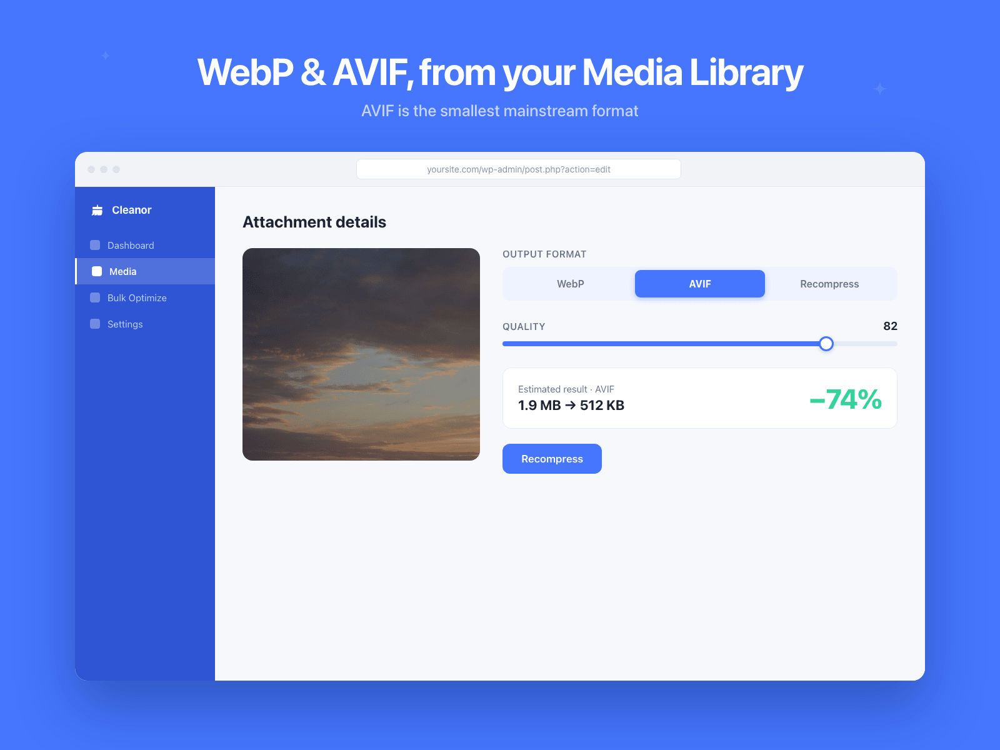

# WordPress Image Optimizer: WebP and AVIF Converter for the Media Library

**Free WordPress image optimizer that compresses your Media Library and converts images to WebP or AVIF, on your own server, with no account and no API key.**

[](LICENSE)
[](https://wordpress.org/plugins/cleanor-tools/)
[](https://wordpress.org/)
[](https://www.php.net/)

Published on WordPress.org as **[Cleanor: Image Compressor & Converter](https://wordpress.org/plugins/cleanor-tools/)**. Plugin home page: **[cleanor.app/wordpress](https://cleanor.app/wordpress)**.

Cleanor compresses every image in your WordPress Media Library and converts it to a next-gen format (WebP or AVIF). By default it does the work **on your own server** with Imagick or GD, keeps your original files and URLs exactly as they are, and serves the modern copies through a `<picture>` tag. Smaller images mean faster pages, a better Largest Contentful Paint, and less disk space.



## Install

**From WordPress.org (recommended)**

1. Go to **Plugins, Add New** in your dashboard.
2. Search for **Cleanor: Image Compressor & Converter**, then click **Install Now** and **Activate**.

**From a zip**

1. Download the zip from [wordpress.org/plugins/cleanor-tools](https://wordpress.org/plugins/cleanor-tools/) (Download button) or from this repo's [Releases](https://github.com/cleanor-app/wordpress-image-optimizer/releases).
2. Go to **Plugins, Add New, Upload Plugin**, choose the zip, click **Install Now**, then **Activate**. (Or unzip the `cleanor-tools` folder into `wp-content/plugins/`.)

**Quick start (about a minute)**

1. Open the new **Cleanor** menu, then **Settings**.
2. Pick a compression preset (Balanced, Aggressive, Near-lossless or Custom) and an output format (WebP, AVIF, or recompress and keep the format).
3. Save. Every new upload is now optimized automatically, thumbnails included.
4. For images you already have, open **Cleanor, Bulk Optimize** and click **Start optimizing**.

No account, no API key, no per-image credits.

## Requirements

| | |
| --- | --- |
| WordPress | 6.0 or newer |
| PHP | 7.4 or newer |
| Image library | Imagick or GD for on-server optimization (the free Cleanor API is the fallback) |
| License | [GPL-2.0-or-later](LICENSE) |

## Convert the Media Library to WebP or AVIF

Choose **WebP** (widest browser support), **AVIF** (smallest files), or **Recompress, keep format** to shrink JPEGs without changing the extension. Source images can be JPEG, PNG, WebP or AVIF. GIF and SVG are skipped for safety.

**Cleanor, Bulk Optimize, Convert to a modern format** re-encodes your whole library to WebP or AVIF in a single pass, following your current delivery mode.

See [docs/convert-wordpress-images-to-webp.md](docs/convert-wordpress-images-to-webp.md) and [docs/wordpress-avif-support.md](docs/wordpress-avif-support.md).

## Keep originals, or replace files

This is the **Delivery** setting, and it is the most important choice you make.

- **Keep originals, serve modern (default).** Non-destructive. Your original file, its extension, its URL and its MIME type never change. Cleanor writes a sibling copy next to each image (`photo.jpg.webp`) and serves it to supporting browsers through a `<picture>` element, with automatic fallback to the untouched original. Reverting an image is just deleting the copy.
- **Replace files.** The classic behavior. The file on disk is rewritten to WebP or AVIF, and WordPress is repointed to it everywhere it references the attachment. Smallest storage, but extensions and URLs change, so old direct hot-links to the previous extension would need updating.

You can switch modes at any time in **Cleanor, Settings, Delivery**.

## Optimize on your own server (no external requests)

The **Engine** setting decides where the re-encoding happens:

- **Auto (default):** re-encode locally with Imagick or GD, and fall back to the free Cleanor API only when the server cannot produce the format (most often AVIF).
- **On this server only:** nothing is ever sent anywhere.
- **Cleanor API only:** always use the endpoint (`https://mcp.cleanor.app` by default, or your own).

The Settings screen shows the capabilities it detected on your host (Imagick or GD, WebP, AVIF).

## Resize large uploads and strip metadata

- **Resize:** set a maximum width (for example 2560) and any wider image is downscaled before it is stored, so a 6000px phone photo does not ship at full resolution. Set it to 0 to keep original dimensions. Generated thumbnails are not touched by this setting.
- **Strip metadata:** remove EXIF, GPS and camera data on every conversion, for smaller files and less location data in your uploads. On by default.

## Restore backups

Keeping a `.bak` copy of each replaced original is **on by default**, which is what powers Restore. You can restore a single image from its Media Library row action, or the whole library in one click. In the default keep mode, restoring simply deletes the generated copies, because the original was never modified.

## Core Web Vitals and PageSpeed

- Optionally **preload the featured image** in its modern format on single posts and pages, a high priority `<link rel="preload">` with `fetchpriority="high"`, which usually improves Largest Contentful Paint. It adds no extra requests and can be turned off in **Settings, Performance**.
- The Dashboard has a one-click **Test my site on PageSpeed Insights** button with your address prefilled. Add a free PageSpeed Insights API key in Settings to see your mobile Performance score and LCP on the Dashboard itself.
- WordPress core already handles lazy loading, async decoding and image width/height, so Cleanor does not duplicate them.

See [docs/serve-images-in-next-gen-formats.md](docs/serve-images-in-next-gen-formats.md).

## See what was optimized, and reclaim space

- A **Cleanor** column in the Media Library shows the percentage each image saved, plus a running total.
- A **Cleanor status** filter above the list (all, optimized, not optimized, restorable).
- Native **Bulk Actions**: "Optimize with Cleanor" and "Restore original (Cleanor)" for a hand-picked selection.
- The **Images** screen lists every processed image with its before and after size, percentage saved, format, and a direct link to the exact file being served.
- **CleanUp** deletes kept `.bak` originals, orphaned WebP/AVIF copies whose source is gone, and scaled-original files. It can also move images that appear to be used nowhere to the Trash, where they stay recoverable.

## Docs

| Guide | What it answers |
| --- | --- |
| [Convert WordPress images to WebP](docs/convert-wordpress-images-to-webp.md) | How to convert the whole Media Library to WebP, automatically and in bulk |
| [Serve images in next-gen formats](docs/serve-images-in-next-gen-formats.md) | How to fix the PageSpeed Insights "Serve images in next-gen formats" audit |
| [WordPress AVIF support](docs/wordpress-avif-support.md) | Whether WordPress supports AVIF, and how to use it safely |
| [Bulk optimize the WordPress Media Library](docs/bulk-optimize-the-wordpress-media-library.md) | How to compress thousands of existing images in one pass |

## FAQ

### Do I need an account or an API key?

No. With the default Auto engine, images are re-encoded right on your server with Imagick or GD, and nothing is sent anywhere. If the API fallback is used, it is free and key-free (rate limited per site). The API key field exists for self-hosting and future plans.

### Will converting to WebP break my image URLs?

Not in the default "Keep originals, serve modern" mode. Your files, extensions and URLs are never changed: Cleanor stores a WebP or AVIF copy beside each image and serves it through a `<picture>` tag, so supporting browsers get the smaller file and everything else falls back to your untouched original. Only "Replace files" mode changes the extension and the URL.

### Are my images sent to an external service?

Not with the default Auto engine when your server can produce the format, and almost every host can produce WebP via Imagick or GD. The Cleanor API is contacted only as a fallback, most often for AVIF on hosts without AVIF support. Choose "On this server only" in Settings to guarantee no external requests at all.

### Which image formats can it read and write?

It reads JPEG, PNG, WebP and AVIF. It writes WebP, AVIF, or the same format again (recompression). GIF and SVG are skipped for safety.

### Where are the optimized copies? I do not see them in the Media Library.

That is expected in the default keep mode. The optimized copy is a sibling file on disk (`photo.jpg.webp`), not a separate attachment, so it does not appear as its own Media Library item, and the original's size is unchanged. Open **Cleanor, Images** to see every processed image with its before and after size and a link to the exact file being served.

### Does it optimize thumbnails too?

Yes, when "Also convert generated thumbnail sizes" is enabled, which is the default. Every size WordPress generated for the attachment is processed alongside the full-size image.

### Can I use my own optimization server?

Yes. Point the **API endpoint** setting at any server that implements the Cleanor `/v1/optimize` contract. The default is `https://mcp.cleanor.app`.

## Developer reference

### Structure

```
cleanor-tools.php                     Entry point: header, bootstrap, activation
includes/class-cleanor-settings.php   Options store, settings screen, running totals
includes/class-cleanor-api.php        HTTP client for /v1/optimize and /v1/capabilities
includes/class-cleanor-local.php      On-server encoder (Imagick, then GD)
includes/class-cleanor-optimizer.php  Core: upload hook, conversion, metadata rewrite, media column
includes/class-cleanor-bulk.php       Bulk Optimize and bulk format conversion (AJAX)
includes/class-cleanor-restore.php    Restore originals (per image and bulk)
includes/class-cleanor-serve.php      <picture> wrapping and the LCP preload
includes/class-cleanor-cleanup.php    CleanUp: backups, orphans, scaled originals, unused images
includes/class-cleanor-admin.php      Branded admin cabinet: menu, Dashboard, Images, Help
uninstall.php                         Removes plugin options
readme.txt                            The WordPress.org listing manifest
```

### Hooks

| Filter | Args | Purpose |
| --- | --- | --- |
| `cleanor_setting_{key}` | `$value, $opts` | Override any setting at read time (for example, inject the API key from `wp-config.php`). |
| `cleanor_target_format` | `$format, $path, $mime` | Change the output format per file. |
| `cleanor_quality` | `$quality, $path, $mime` | Change encode quality per file. |
| `cleanor_replace_when_larger` | `$bool, $path` | Keep the optimized file even when it is not smaller (default `false`). |
| `cleanor_wrap_picture` | `$bool, $attachment_id, $html` | Opt an image out of `<picture>` wrapping. |
| `cleanor_lcp_image_size` | `$size, $attachment_id` | The registered image size used for the LCP preload (default `large`). |

| Action | Args | Purpose |
| --- | --- | --- |
| `cleanor_after_optimize` | `$attachment_id, $stats, $metadata` | Runs after an attachment is optimized. |
| `cleanor_after_restore` | `$attachment_id` | Runs after an attachment is restored. |

Example, force AVIF at quality 60 for a gallery folder:

```php
add_filter( 'cleanor_target_format', function ( $format, $path ) {
    return str_contains( $path, '/gallery/' ) ? 'avif' : $format;
}, 10, 2 );
```

### API contract

```
GET  /v1/capabilities  → { version, auth, tools[], rest.optimize{...} }
POST /v1/optimize      → multipart file (or JSON image_url, or raw body)
                         with format / quality / width; returns optimized bytes
                         (or ?json=1 for base64).
```

All file I/O goes through `WP_Filesystem`. All admin actions are nonce-checked and capability-gated, all output is escaped, all input is sanitized.

## Related projects

| Project | What it is |
| --- | --- |
| [browser-image-tools](https://github.com/cleanor-app/browser-image-tools) | Image compression and conversion that runs entirely in the browser |
| [image-compressor-chrome-extension](https://github.com/cleanor-app/image-compressor-chrome-extension) | The same optimizer as a Chrome extension |
| [figma-image-compressor](https://github.com/cleanor-app/figma-image-compressor) | Compress and convert images inside Figma |
| [cleanor-mcp](https://github.com/cleanor-app/cleanor-mcp) | The Cleanor MCP server, image tools for AI agents |
| [cleanor-storage-lab](https://github.com/cleanor-app/cleanor-storage-lab) | The open, reproducible image compression benchmarks |

No WordPress? Use the same optimizer in your browser at [cleanor.app/tools](https://cleanor.app/tools), and see the open [compression benchmarks](https://cleanor.app/research) behind it.

## Contributing

Issues and pull requests are welcome. This repository mirrors the plugin published on WordPress.org, so please follow the [WordPress coding standards](https://developer.wordpress.org/coding-standards/): all output escaped, all input sanitized, admin actions nonce-checked and capability-gated. Test against a clean WordPress install before opening a PR.

## License

[GPL-2.0-or-later](LICENSE). Copyright Cleanor Labs. More at [cleanor.app/wordpress](https://cleanor.app/wordpress).
